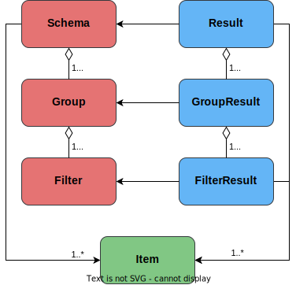

# [Documentation]({{site.baseurl}}{{page.url}})

With filtering.js you can easily add filtering functionality to your project. It is a small, fast, and modern library without dependencies that can be used in node and browser environments.

**TODO: Improve documentation, check out code in the [examples]({{site.baseurl}}/examples.html) for now.**

In a browser environment, you can use helper functions like `Parser` and `FilteringFlow` to [create a schema including filters, groups and items from HTML](#initialize-filteringjs-from-html). To do so use the [UI version](https://github.com/robertpainsi/filtering.js/blob/main/dist/index.ui.js) of filtering.js. Alternatively or in a node environment use the [core version](https://github.com/robertpainsi/filtering.js/blob/main/dist/index.core.js) and the provided classes to [create a schema including filters, groups and items from JavaScript](#initialize-filteringjs-from-javascript).
Start using the library by checking out the [examples]({{site.baseurl}}/examples.html). If you need more information, use the [API]({{site.baseurl}}/api/index.html) and [Documentation]({{site.baseurl}}/documentation.html) pages.

### Initialize filtering.js from HTML

```html
<div id="root">
    <div>
        <div class="filtering-group" data-group-name="color">
            <div class="filtering-filter" data-filter-name="red">Red</div>
            <div class="filtering-filter" data-filter-name="blue">Blue</div>
        </div>
        <div class="filtering-group" data-group-name="size">
            <div class="filtering-filter" data-filter-name="small">Small</div>
            <div class="filtering-filter" data-filter-name="large">Large</div>
        </div>
    </div>

    <div>
        <div class="filtering-item" data-filter-color="red" data-filter-size="small"></div>
        <div class="filtering-item" data-filter-color="blue" data-filter-size="large"></div>
    </div>
</div>

<script>
    // Either use FilteringFlow to parse and initialize filters, groups
    // and items from HTML and also handle other logic automatically.
    // For more information, see chapter FilteringFlow.
    const {FilteringFlow} = filteringjs;
    const filteringFlow = new FilteringFlow(document.querySelector('#root'));
    // ...

    // Or parse and initialize filters, groups and items from HTML
    const {Filtering, Parser} = filteringjs;
    const parser = new Parser();
    const schema = parser.parseSchemaFromHtml(document.querySelector('#root'));
    const filtering = new Filtering(schema);
    // ...
</script>
```

### Initialize filtering.js from JavaScript

```js
// Initializing filters, groups and items from JavaScript
const {Filtering, Schema, Group, Filter, Item} = filteringjs;

const schema = new Schema();

// Create a new group `color` with colors `red` and `blue`
const colorGroup = new Group('color');
colorGroup.addFilter(new Filter('red'));
colorGroup.addFilter(new Filter('blue'));
schema.addGroup(colorGroup);

// Create a new group `size` with sizes `small` and `large`
const sizeGroup = new Group('size');
sizeGroup.addFilter(new Filter('small'));
sizeGroup.addFilter(new Filter('large'));
schema.addGroup(sizeGroup);

// Add a small, red item
const item1 = new Item();
item1.addFilter('color', 'red');
item1.addFilter('size', 'small');
schema.addItem(item1);

// Add a large, blue item
const item2 = new Item();
item2.addFilter('color', 'blue');
item2.addFilter('size', 'large');
schema.addItem(item2);

const filtering = new Filtering(schema);
// ...
```

### Workflow and structure

Once you built a `Schema`, you can use `Filtering.filter` to get a `Result` that contains the items that passes or would pass the filtering. Since `Result` perfectly mirrors the schema, as shown in the [class diagram](#class-diagram-for-schema-result-and-item), you can easily handle both, the items that passes or would pass the filtering and also the schema.

##### #class-diagram-for-schema-result-and-item



> Note that `FilterResult` also has a list of items that *would
pass* the filtering. `Result` and `GroupResult` don't because they would return the same items as `allItems`.

### `FilteringFlow`

`FilteringFlow` is a helper class that can be used in the browser and removes to repetitive work of creating a schema from HTML, initializing filtering and updating the DOM by adding or removing classes. Each step of the workflow can be customized by overriding the corresponding methods.

- `initializeParser`
    - if you want to use custom `ParserOptions`, override this method and return a `Parser` with your options.
- `initializeSchema`
    - if you want to build the `Schema` yourself, override this method and return your `Schema`. This also allows you to partially build the `Schema` by using the `Parser` and by building it yourself.
- `initializeFiltering`
    - if you want to use custom `FilteringOptions`, override this method and return a `Filtering` with your options.
- `initializeFilterListener`
    - this will add a listener to each filter element and will trigger `filter` eventually. The `Parser` automatically stores a reference to the corresponding HTML element in `filter.data.element`. If you parse the schema yourself, you have to add the reference to the HTML element yourself.
- `beforeFilter`
    - is called before any classes are updated and `filter` would be called. Return `false` if you want to abort filtering.
- `filter`
    - parses checked filters from HTML, calculates the `Result` and returns it.
- `handleFilterResult`
    - adds or removes class `disabled` from filter elements and `filtered` from item elements. If you want to add additional logic to handle the `Result`, override this method. Don't forget to call `super.handleFilterResult(result)` to update the classes.
